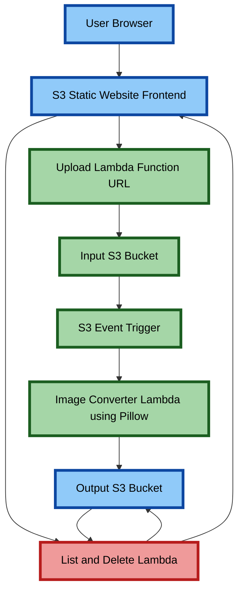

# AWS Serverless Image Converter (JPG/PNG → PNG)

A fully serverless web application that allows users to upload images, automatically converts them into PNG format using AWS Lambda, and provides download & delete functionality using Amazon S3.

---
## Live Demo 
- http://pdf-web-siva-12345.s3-website.ap-south-1.amazonaws.com/
---

##  Features

- Upload Images in JPG or JPEG format.
- Automatic image conversion using AWS Lambda
- Converted files stored in Output S3 Bucket
- Download converted images from the website
- Delete converted images directly from the website
- Fully serverless architecture
- CORS-configured API access
- Static website hosted using Amazon S3

---

##  Architecture Overview



---

##  Technologies Used

- **Frontend:** HTML, CSS, JavaScript  
- **Cloud Platform:** AWS  
- **Storage:** Amazon S3  
- **Backend:** AWS Lambda  
- **Image Processing:** Pillow (Lambda Layer)  
- **API:** Lambda Function URLs  
- **Version Control:** Git & GitHub  

---

##  Project Structure

```text
aws-serverless-image-converter/
├── frontend/
│   ├── index.html
│   ├── style.css
│   └── app.js
├── lambda_converter.py
├── presigned_url.py
├── list_file.py
├── screenshot/
│   ├── ui.jpg
│   └── output.jpg
└── README.md
```

